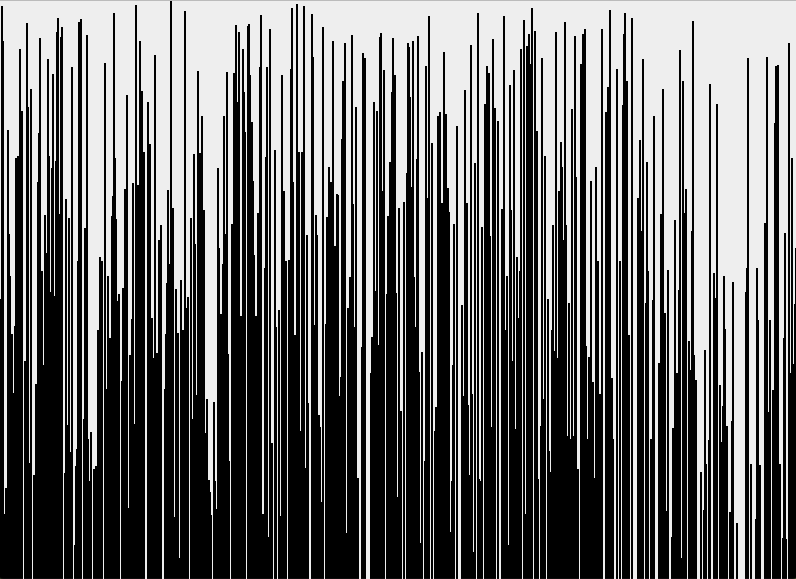
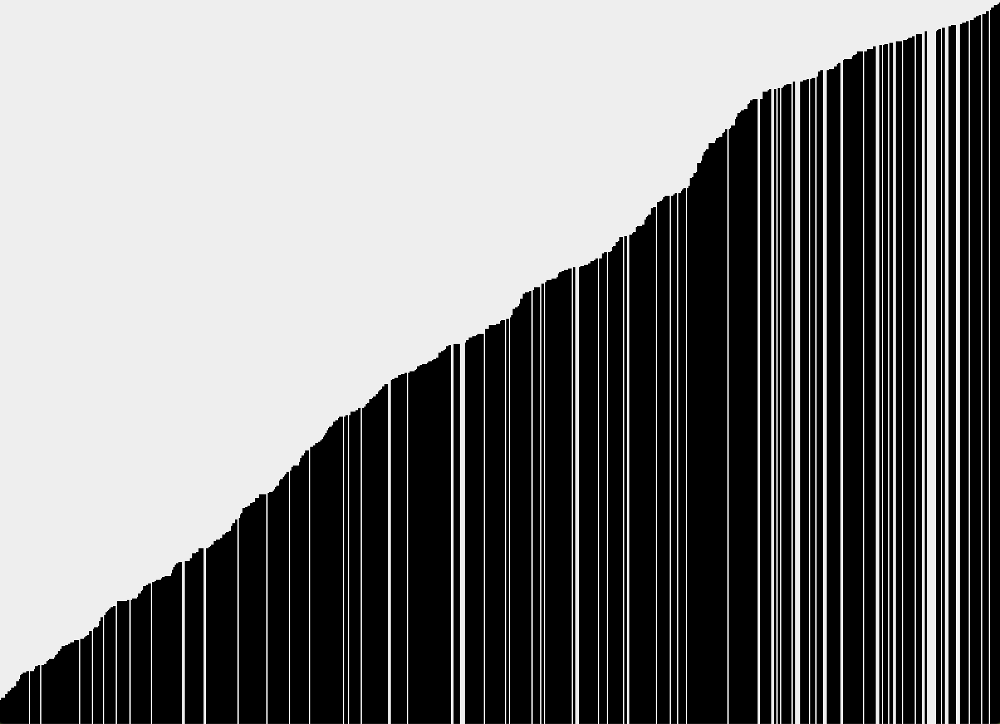

# Sorting-Algorithm-Visualizer
<h2>Overview</h2>
Have you ever wondered what bubble sort looks like? Me neither! However, if you are ever curious, this executable JAR file will show you a very quick step-by-step visualization of how bubble sort works. Press the space bar after launching the Jar file to watch the array sort itself into ascending order.

<h2>Unsorted</h2>

<h2>Sorted</h2>

I have also added a version of the sorting algorithm that includes a sort by colour option in the files.
