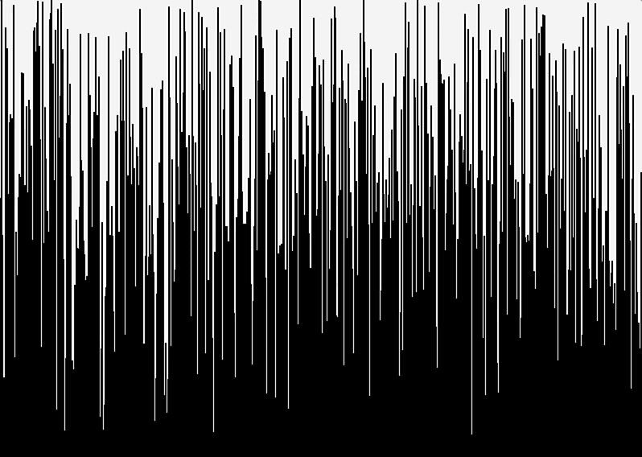
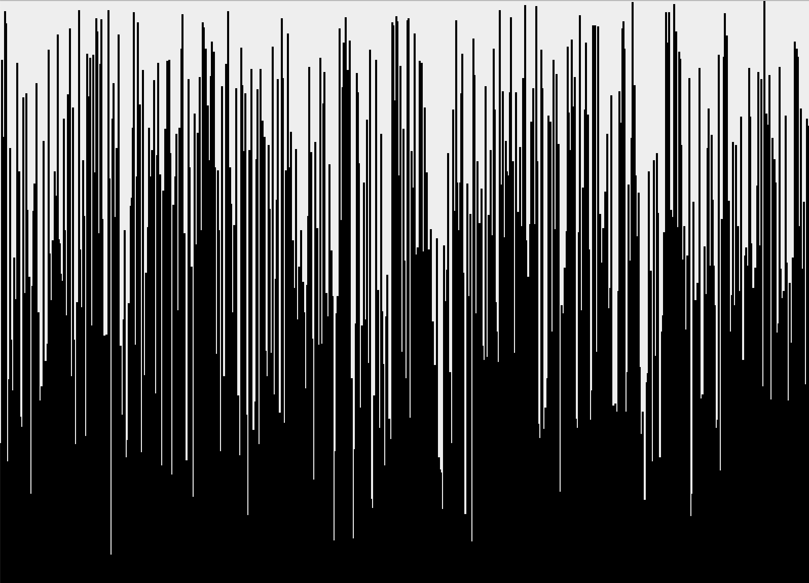

# Sorting-Algorithm-Visualizer
<h2>Overview</h2>

Have you ever wondered what bubble sort looks like? If so, then this executable JAR file will show you a very quick step-by-step visualization of how bubble sort works. Press the space bar after launching the Jar file to watch the array sort itself into ascending order. There are two versions; black or colourful.
<br>



<h2>Unsorted</h2>
The unsorted version of the array is generated at runtime when 800 points are assigned a random x and y value within the jframe and given a height of 600 so that it will extend to the bottom of the panel. The following image is an example of what the user might see when they initially launch the JAR file.
<br>



<h2>Sorted</h2>
The sorted version of the array is a product of a very basic sorting algorithm and happens when the user clicks the space bar. The following image is an example of a sorted array after the user chose to sort the previous image.
<br>


<br>

<h2>Code Snippet</h2>
Below is the acutal sorting that is happening every 5000 internal clicks.  The algorithm runs in O(n^2) and is one of the lesser efficient sorting algorithms. Future updates will include different sorts happening with diffrent button clicks. Future plans also will include a button to re-scramble the points in order to sort them again.

<br>

```
for (int i = 0; i < points; i++) {
    for (int j = 1; j < (points - i); j++) {
        if (ticks % 5000 == 0) {
            if (p[j-1].y < p[j].y) {
               tmpP.y = p[j-1].y;
               p[j-1].y = p[j].y;
               p[j].y = tmpP.y;
             }

             if (p[j-1].x > p[j].x) {
                tmpP.x = p[j].x;
                p[j].x = p[j-1].x;
                p[j-1].x = tmpP.x;
             }
             Selected.x = p[i].x;
             Selected.y = p[i].y;
             renderpanel.repaint();
          }
          ticks++;
      }
}
```
